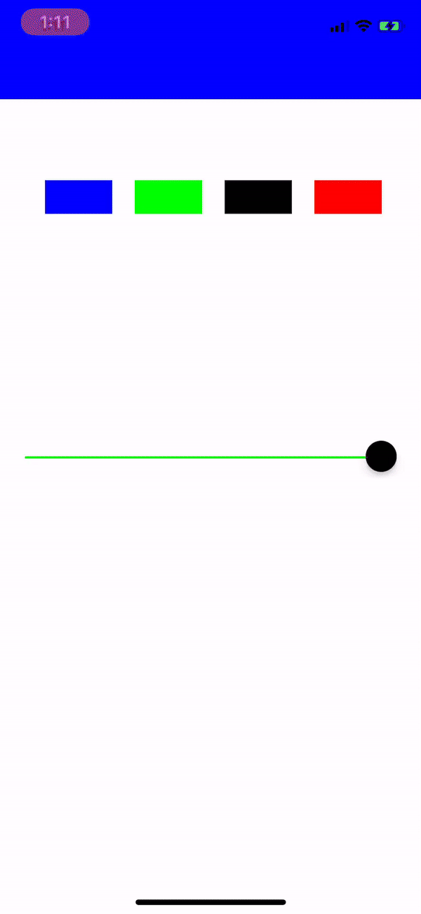

# NavigationController

A customizable navigation bar library with dynamic colors and alphas for Swift.

## Preview


## Setup
You need to inherit the library from KPageViewController:
```
import KNavigationController

class YourNavigationController: NavigationController {
```

Simply assign the navigation bar color:
```
if let nav = self.navigationController as? NavigationController {
    nav.setBackgroundColor(UIColor.white)
}
```

You may adjust the navigation bar's alpha according to scrollView offset
```
if let nav = self.navigationController as? NavigationController {
    nav.setNavigationBarVisibility(offset: offset)
}
```

## Requirements
iOS 9.0 or above <br/>
Support Swift 5.0

## Installation
NavigationController is available through CocoaPods. To install it, simply add the following line to your Podfile:

```
pod "KNavigationController"
```

## Author
Mr. Kam Chun Kit

## License
KNavigationController is available under the MIT license. See the LICENSE file for more info.
